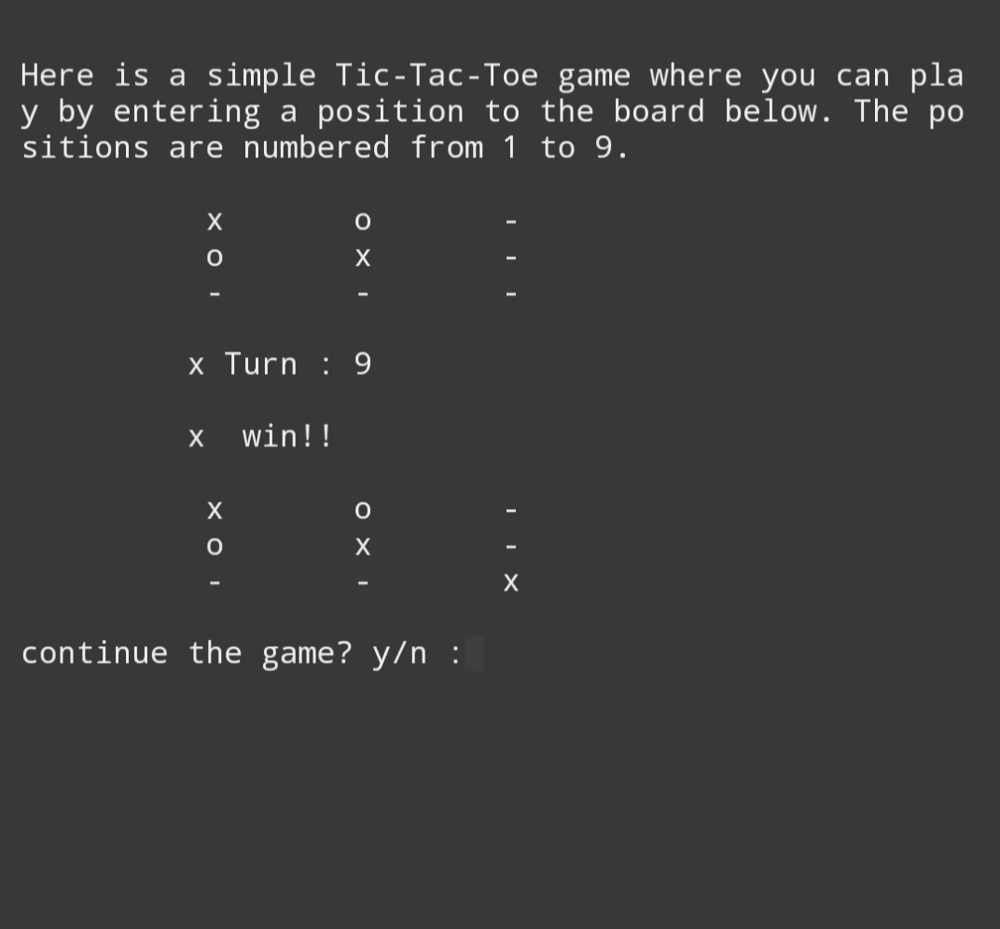

# Tic-Tac-Toe game
it is a game in which two players by turns put crosses and zeros in compartments of a figure formed by two vertical lines crossing two horizontal lines and each tries to get a row of three crosses or three zeros before the opponent does

## Screenshot
Here is the screenshot of the output :

  

